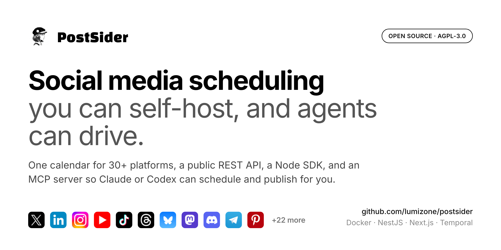

<p align="center">
  
</p>

<h1 align="center">PostSider</h1>

<p align="center">
  <strong>Open-source social media scheduling for humans, teams, and AI agents.</strong>
</p>

<p align="center">
  Schedule and publish across <strong>33 built-in connectors</strong> from one calendar.<br/>
  Self-host with Docker, automate through the REST API and Node.js SDK, or connect AI agents through MCP.
</p>

<p align="center">
  <a href="https://postsider.com"><strong>Website</strong></a>
  ·
  <a href="https://docs.postsider.com"><strong>Documentation</strong></a>
  ·
  <a href="#quick-start"><strong>Quick Start</strong></a>
  ·
  <a href="#ai-agents-mcp"><strong>MCP</strong></a>
  ·
  <a href="#public-api--sdk"><strong>API & SDK</strong></a>
</p>

<p align="center">
  <a href="https://github.com/lumizone/postsider/actions/workflows/ci.yml"></a>
  <a href="https://github.com/lumizone/postsider/releases"></a>
  <a href="https://github.com/lumizone/postsider/stargazers"></a>
  <a href="LICENSE"></a>
  <a href="#self-hosting"></a>
  <a href="apps/mcp/README.md"></a>
</p>

<p align="center">
  
</p>

---

## What is PostSider?

PostSider is an open-source social media management and scheduling platform built around three ways of working:

| Use PostSider as | What you get |
|---|---|
| **Social media scheduler** | One calendar for planning, composing, approving, scheduling, and publishing content |
| **Self-hosted platform** | A Docker-based deployment you can run on your own infrastructure |
| **Automation backend** | A public REST API plus the `@postsider/node` SDK |
| **AI-agent bridge** | An MCP server that lets compatible agents work with PostSider through structured tools |

PostSider ships with **33 active connectors** registered in the application. You configure credentials only for the platforms you actually use.

AI features are optional. PostSider works without an OpenAI API key.

---

## Quick Start

For a local evaluation, the fastest path is Docker Compose.

### Requirements

- Docker
- Docker Compose

### Start PostSider

```bash
git clone https://github.com/lumizone/postsider.git
cd postsider
docker compose up -d
```

The default Compose stack pulls:

```text
ghcr.io/lumizone/postsider-app:latest
```

and starts PostSider with PostgreSQL, Redis, and Temporal.

Open:

```text
http://localhost:4007
```

Create the first administrator account:

```bash
docker exec -it postsider pnpm bootstrap
```

The bootstrap command prints a one-time password. Sign in with:

```text
admin@setup.local
```

and the generated password. PostSider then prompts you to set your real email address and password.

> The root `docker-compose.yaml` is convenient for local evaluation. For an internet-facing deployment, use the production setup and the [self-hosting guide](https://docs.postsider.com/self-hosting).

---

## Highlights

### Scheduling and publishing

- Visual calendar with drag-and-drop scheduling
- Posting queue and find-free-slot scheduling
- Smart Slot suggestions
- Evergreen content recycling
- Per-platform previews
- Per-platform validation before publishing
- Automatic first comments where supported
- Bulk CSV import

### Content workflow

- Hashtag groups
- Caption templates
- Reusable snippets
- UTM builder
- Draft and approval workflows
- Shared media library

### Teams and organizations

- Multi-organization workspaces
- Separate workspaces for brands or clients
- Admin and User roles
- Shared publishing workflow

### Automation

- Public REST API
- Node.js SDK: `@postsider/node`
- MCP server: `@postsider/mcp`
- Webhooks
- Programmatic scheduling and channel access

### Optional AI

- Post Checker
- Caption rewriting
- Platform-level `OPENAI_API_KEY`
- Per-organization bring-your-own key support

### Security

- Optional TOTP two-factor authentication
- One-time recovery codes
- Organization-wide 2FA enforcement
- Encrypted provider credentials at rest
- Security activity trail
- Secure `httpOnly` cookies
- CORS and CSP controls
- Rate limiting
- Server-side authorization and plan enforcement

---

## Supported Platforms

The list below mirrors the active providers registered in:

[`libraries/nestjs-libraries/src/integrations/integration.manager.ts`](libraries/nestjs-libraries/src/integrations/integration.manager.ts)

| Category | Platforms |
|---|---|
| **Social & creator platforms** | X, LinkedIn Profile, LinkedIn Page, Facebook, Instagram via Facebook, Instagram Standalone, Threads, YouTube, TikTok, Pinterest, Bluesky, Mastodon, Nostr, Farcaster, Lemmy, Twitch, Dribbble, Google Business Profile, Whop, Moltbook |
| **Chat & community** | Discord, Slack, Telegram |
| **Blogs & publishing** | Dev.to, Hashnode, Medium, WordPress, Ghost, Blogger, Notion, Mataroa, Write.as, Listmonk |

That is **33 active connectors** in the current integration registry.

You only need OAuth/API credentials for the providers you intend to use. See:

- [`.env.example`](.env.example)
- [Channel configuration](https://docs.postsider.com/channels/overview)
- [Environment configuration](https://docs.postsider.com/configuration/environment)

Mastodon supports custom instances through the standard Mastodon provider.

### Adding a provider

Provider integrations live in:

```text
libraries/nestjs-libraries/src/integrations/social/
```

A new connector typically:

1. Extends `SocialAbstract`
2. Implements `SocialProvider`
3. Is registered in `socialIntegrationList` in `integration.manager.ts`
4. Adds the corresponding frontend platform metadata/assets

New provider integrations are especially welcome as pull requests.

---

## AI Agents (MCP)

PostSider includes an MCP server for compatible AI clients and agents.

The package is:

```text
@postsider/mcp
```

The MCP layer is a thin interface over PostSider's public API and exposes **19 tools** for workflows such as:

- Listing connected channels
- Reviewing the publishing calendar
- Creating drafts
- Requesting approval
- Uploading media
- Working with scheduled content
- Reading analytics

The intended workflow is **read-first and draft-first**: an agent can prepare work inside the same PostSider workflow used by humans, while publishing remains a deliberate action.

### Build the MCP server

```bash
pnpm --filter @postsider/mcp build
```

For a local/stdio connection, configure:

```text
POSTSIDER_API_KEY
POSTSIDER_API_URL
```

`POSTSIDER_API_URL` points the MCP server at the PostSider instance you want to use.

Full MCP documentation:

- [`apps/mcp/README.md`](apps/mcp/README.md)
- [Hosted MCP walkthrough](https://docs.postsider.com/cloud/mcp)

### Claude Code plugin

This repository also contains the Claude Code plugin metadata and the `postsider-workflow` skill.

```bash
claude plugin marketplace add lumizone/postsider
claude plugin install postsider@postsider
```

A safe read-only connection check:

```text
List my connected PostSider channels. Do not create or modify anything.
```

---

## Public API & SDK

PostSider exposes a public REST API for external applications and automation.

Authenticate with your organization's API key.

### Node.js SDK

The published SDK package is:

```bash
npm install @postsider/node
```

Example:

```typescript
import Postsider from '@postsider/node';

const client = new Postsider(
  'your-api-key',
  'https://your-instance.com'
);

// Schedule a post
await client.post({
  type: 'schedule',
  date: '2025-01-15T10:00:00',
  posts: [
    {
      integration: { id: 'channel-id' },
      value: [{ content: 'Hello!' }],
    },
  ],
});

// List posts
const posts = await client.postList({
  page: 0,
  limit: 20,
});

// List connected channels
const channels = await client.integrations();
```

The public API is exposed under `/public/v1`.

---

## Architecture

PostSider is a TypeScript `pnpm` monorepo.

```text
postsider/
├── apps/
│   ├── backend/          # NestJS REST API
│   ├── orchestrator/     # Temporal workers
│   ├── frontend/         # Next.js dashboard
│   ├── commands/         # CLI/bootstrap utilities
│   ├── sdk/              # @postsider/node
│   └── mcp/              # @postsider/mcp
├── libraries/
│   ├── nestjs-libraries/ # Shared backend, database, integrations
│   └── helpers/          # Shared utilities
├── docker-compose.yaml
├── docker-compose.production.yaml
└── .env.example
```

### Tech stack

| Layer | Technology |
|---|---|
| Backend API | NestJS 11, TypeScript |
| Frontend | Next.js 15, React 19 |
| Database | PostgreSQL + Prisma 6.5 |
| Cache | Redis |
| Workflow engine | Temporal |
| AI | OpenAI, optional |
| Billing | Polar.sh, optional |
| Storage | Local filesystem, Cloudflare R2, or MinIO |
| Authentication | JWT, GitHub OAuth, Google OAuth, Generic OIDC |
| Monitoring | Sentry |

### Design decisions

**Temporal for durable scheduling**

Scheduled publishing and token-refresh work run through Temporal workflows so background jobs are not tied to one web-process lifetime.

**Provider-based integrations**

Each social platform is implemented behind a common provider interface. The active registry lives in `integration.manager.ts`.

**Public API first**

External tools can use `/public/v1`, while Node.js consumers can use `@postsider/node`.

**One codebase for hosted and self-hosted deployments**

Optional capabilities are controlled through environment configuration. Billing and AI are not required for a self-hosted installation.

---

## Configuration

Start from the example environment file:

```bash
cp .env.example .env
```

The primary local-development settings are:

| Variable | Purpose |
|---|---|
| `DATABASE_URL` | PostgreSQL connection string |
| `REDIS_URL` | Redis connection string |
| `JWT_SECRET` | JWT signing secret |
| `BACKEND_URL` | URL used to reach the backend |
| `FRONTEND_URL` | URL used to reach the frontend |
| `NEXT_PUBLIC_BACKEND_URL` | Public backend URL embedded in the frontend |
| `BACKEND_INTERNAL_URL` | Backend URL used by internal services |

For production, set a dedicated `ENCRYPTION_KEY` as documented in [`.env.example`](.env.example).

The full reference is maintained in:

- [`.env.example`](.env.example)
- [PostSider environment documentation](https://docs.postsider.com/configuration/environment)

### Storage

Local storage is the default:

```env
STORAGE_PROVIDER=local
UPLOAD_DIRECTORY=./uploads
```

Cloudflare R2 and MinIO are also supported through environment configuration.

### Provider credentials

Social providers have their own API/OAuth settings. You do **not** need to configure all 33 providers.

Configure only the services you plan to connect.

---

## Self-Hosting

PostSider is designed to run on your own infrastructure.

Two Compose files are included:

| File | Purpose |
|---|---|
| `docker-compose.yaml` | Simple local/evaluation stack using the published GHCR image |
| `docker-compose.production.yaml` | Production-oriented stack built from the repository |

The production stack includes the PostSider application, PostgreSQL, Redis, MinIO, Temporal, and supporting services used by the deployment.

For production, use the dedicated guide:

**[Self-host PostSider](https://docs.postsider.com/self-hosting)**

The production Compose file intentionally expects production secrets and deployment-specific values rather than shipping usable defaults.

---

## Local Development

### Requirements

- Node.js `>=20.17.0 <23.0.0`
- pnpm `10.6.x`
- PostgreSQL
- Redis

Clone and install:

```bash
git clone https://github.com/lumizone/postsider.git
cd postsider
pnpm install
```

Create your environment file:

```bash
cp .env.example .env
```

Apply database migrations:

```bash
pnpm prisma-migrate-deploy
```

Create the initial admin:

```bash
pnpm bootstrap
```

Start the backend and orchestrator:

```bash
pnpm dev
```

In another terminal, start the frontend:

```bash
pnpm dev:frontend
```

Default development URLs:

```text
Backend:  http://localhost:3000
Frontend: http://localhost:4200
```

### Useful commands

```bash
# Backend only
pnpm dev:backend

# Orchestrator only
pnpm dev:orchestrator

# Frontend only
pnpm dev:frontend

# Generate Prisma client
pnpm prisma-generate

# Create a Prisma migration
pnpm prisma-migrate-dev

# Apply migrations
pnpm prisma-migrate-deploy

# Build backend + orchestrator
pnpm build

# Build the Node.js SDK
pnpm build:sdk
```

---

## Contributing

Contributions are welcome.

Good places to contribute include:

- New provider integrations
- Bug fixes with clear reproduction steps
- Documentation
- Performance improvements
- Automated tests
- Type-safety improvements

Typical workflow:

```bash
git checkout -b feature/my-feature
# make changes
pnpm run build:backend
```

Then open a pull request with a clear explanation of the change.

For provider-specific contribution steps, see [`CONTRIBUTING.md`](CONTRIBUTING.md).

---

## Roadmap

- [x] GitHub Actions CI
- [x] Runtime image published to GHCR
- [x] Public REST API
- [x] Node.js SDK
- [x] MCP server
- [ ] Broader automated coverage for core flows
- [ ] Enable `strictNullChecks` across the codebase
- [ ] Mobile app
- [ ] Plugin system for custom integrations
- [ ] Advanced analytics dashboard

---

## Support PostSider

If PostSider is useful to you, consider starring the repository. It helps other developers discover the project.

<p align="center">
  <a href="https://github.com/lumizone/postsider/stargazers">
    
  </a>
</p>

Bug reports, feature requests, and pull requests are also appreciated.

---

## License

PostSider is licensed under the [GNU Affero General Public License v3.0](LICENSE).

You may use, modify, and distribute PostSider under the terms of the AGPL-3.0. If you run a modified version as a network service, the license requires the corresponding source code to be made available to users of that service.

---

<p align="center">
  <strong>PostSider</strong><br/>
  Open-source social media scheduling for humans, teams, and AI agents.
</p>

<p align="center">
  <a href="https://postsider.com">Website</a>
  ·
  <a href="https://docs.postsider.com">Docs</a>
  ·
  <a href="https://github.com/lumizone/postsider">GitHub</a>
</p>
